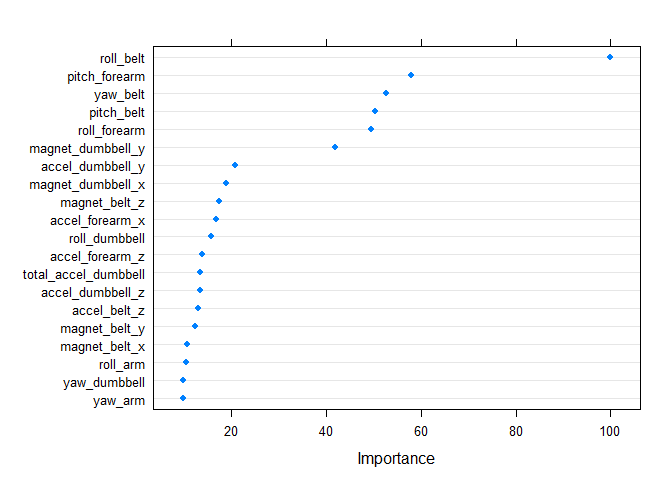

##Introduction to the Project##

Using devices such as Jawbone Up, Nike FuelBand, and Fitbit it is now possible to collect a large amount of data about personal activity relatively inexpensively. These type of devices are part of the quantified self movement – a group of enthusiasts who take measurements about themselves regularly to improve their health, to find patterns in their behavior, or because they are tech geeks. One thing that people regularly do is quantify how much of a particular activity they do, but they rarely quantify how well they do it. In this project, the goal is to use data from accelerometers on the belt, forearm, arm, and dumbell for 6 participants who were asked to perform barbell lifts correctly and incorrectly in 5 different ways. 

More information is available from the website here: http://web.archive.org/web/20161224072740/http:/groupware.les.inf.puc-rio.br/har (see the section on the Weight Lifting Exercise Dataset).


##Data Source##

The data for this project have been generously made public by **Human Activity Recognition**: Ugulino, W.; Cardador, D.; Vega, K.; Velloso, E.; Milidiu, R.; Fuks, H. **Wearable Computing: Accelerometers' Data Classification of Body Postures and Movements**. Proceedings of 21st Brazilian Symposium on Artificial Intelligence. Advances in Artificial Intelligence - SBIA 2012. In: Lecture Notes in Computer Science. , pp. 52-61. Curitiba, PR: Springer Berlin / Heidelberg, 2012. ISBN 978-3-642-34458-9. DOI: 10.1007/978-3-642-34459-6_6. 

Their website is http://groupware.les.inf.puc-rio.br/har.

##Goal##

Predict the manner in which the participants did the exercise. The target is the "classe" variable. 

Use 20 different test cases.

Predict with any or all the other variables.

##Data Preparation##

Load libraries, load data, drop useless variables, 


```r
suppressPackageStartupMessages(library(caret)) 
suppressPackageStartupMessages(library(doParallel)) 
suppressPackageStartupMessages(library(gbm))       
suppressPackageStartupMessages(library(knitr)) 
suppressPackageStartupMessages(library(rpart))
suppressPackageStartupMessages(library(rattle)) 
suppressPackageStartupMessages(library(randomForest)) 
suppressPackageStartupMessages(library(tidyverse))

training <- suppressMessages(read_csv("pml-training.csv"))
```

```
## Warning: Missing column names filled in: 'X1' [1]
```

```
## Warning in rbind(names(probs), probs_f): number of columns of result is not
## a multiple of vector length (arg 1)
```

```
## Warning: 185 parsing failures.
## row # A tibble: 5 x 5 col     row col               expected actual  file               expected   <int> <chr>             <chr>    <chr>   <chr>              actual 1  2231 kurtosis_roll_arm a double #DIV/0! 'pml-training.csv' file 2  2231 skewness_roll_arm a double #DIV/0! 'pml-training.csv' row 3  2255 kurtosis_roll_arm a double #DIV/0! 'pml-training.csv' col 4  2255 skewness_roll_arm a double #DIV/0! 'pml-training.csv' expected 5  2282 kurtosis_roll_arm a double #DIV/0! 'pml-training.csv'
## ... ................. ... ............................................................. ........ ............................................................. ...... ............................................................. .... ............................................................. ... ............................................................. ... ............................................................. ........ .............................................................
## See problems(...) for more details.
```

```r
#Parsing failures: they look like notes at the end of the sheet. They're harmless.

testing <- suppressMessages(read_csv("pml-testing.csv"))
```

```
## Warning: Missing column names filled in: 'X1' [1]
```

```r
dim(training); dim(testing)
```

```
## [1] 19622   160
```

```
## [1]  20 160
```

```r
#Keep only variables without missing values
training <- training[, (colSums(is.na(training)) == 0)]
testing <- testing[, (colSums(is.na(testing)) == 0)]

#eliminate more useless columns
training <- training %>% 
        dplyr::select(-X1, -user_name, 
                      -raw_timestamp_part_1,
                      -raw_timestamp_part_2,
                      -cvtd_timestamp,
                      -new_window,
                      -num_window)
testing <- testing %>%
        dplyr::select(-X1, -user_name, 
                      -raw_timestamp_part_1,
                      -raw_timestamp_part_2,
                      -cvtd_timestamp,
                      -new_window,
                      -num_window)

dim(training); dim(testing)
```

```
## [1] 19622    50
```

```
## [1] 20 53
```
Now we have 50 variables instead of 160. However, the training set is still huge (19622 rows) while the testing set is small (20 rows). We can use 30% of the training data to create a validation set.


```r
set.seed(9699)
inTrain <- createDataPartition(y = training$classe, p = 0.7, list = FALSE)
training <- training[inTrain, ]
validation <- training[-inTrain, ]
table(training$classe); table(validation$classe)
```

```
## 
##    A    B    C    D    E 
## 3906 2658 2396 2252 2525
```

```
## 
##    A    B    C    D    E 
## 1163  801  730  670  758
```

##Build the Model##

I think random forest performs exceptionally well, generally, so I decided to keep it simple and not bother about the running time. I save the random forest fit to disk because I don't want to take all that time more than once. 

When running this code chunk, be sure to uncomment the training line if it's never been run before. Otherwise, just load the fit from the .rds file. 


```r
library(plyr)
```

```
## -------------------------------------------------------------------------
```

```
## You have loaded plyr after dplyr - this is likely to cause problems.
## If you need functions from both plyr and dplyr, please load plyr first, then dplyr:
## library(plyr); library(dplyr)
```

```
## -------------------------------------------------------------------------
```

```
## 
## Attaching package: 'plyr'
```

```
## The following objects are masked from 'package:dplyr':
## 
##     arrange, count, desc, failwith, id, mutate, rename, summarise,
##     summarize
```

```
## The following object is masked from 'package:purrr':
## 
##     compact
```

```r
#train a random forest model

# RUN THIS LINE IF THE MODEL HASN'T BEEN TRAINED: (and take a break)
# fit <- train(classe ~ ., data = training, method = "rf")

#              OR

# RUN THIS LINE IF THE MODEL HAS BEEN TRAINED:
fit <- readRDS(file = "rf_fit.rds")

#save the fitted model (if necessary)
#saveRDS(fit,file = "rf_fit.rds")

#plot the important variables in the fit

dotPlot(varImp(fit))
```

<!-- -->

The dot plot is interesting. It looks like a single variable, `roll_belt`, could explain all the variance. 


##Cross-validation##

Cross-validating the fit against validation set, we get a 100% accuracey rate. 


```r
x_validate <- predict(fit, validation) #use the new model and validation data
table(x_validate, validation$classe) #check the accuracy
```

```
##           
## x_validate    A    B    C    D    E
##          A 1163    0    0    0    0
##          B    0  801    0    0    0
##          C    0    0  730    0    0
##          D    0    0    0  670    0
##          E    0    0    0    0  758
```


##Expected Outcome of Sample Error##

I expect that the sample error rate will be very low (perhaps 0), first because there was so much data for training, and second because the validation test was 100% accurate. 


```r
testing$classe <- predict(fit, testing)
table(testing$classe)
```

```
## 
## A B C D E 
## 7 8 1 1 3
```

##Justification for Choices Made##

I decided that training using random forests without using any other techniques would probably work because (a) this version of the random forest method in caret has been performing quite well in other studies, and (b) there is so much data that almost any valid model should give solid prediction results. In short, I traded running time for complicated code and went with simple but inefficient. 


\O

